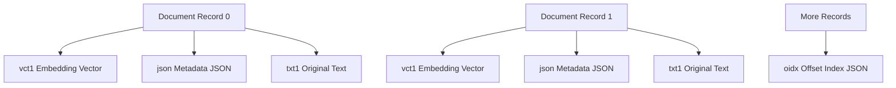

# MP4-Based Vector Store

A lightweight, hackable vector storage system built on the MP4 container format — storing **embeddings**, **metadata**, and **original text** as structured binary segments. Powered by **FAISS** for fast similarity search and **Ollama** for embedding generation.

> 🔊 Inspired by ideas from the MemVid project. Special thanks to the open-source community for shaping foundational concepts around custom MP4 box encoding.

---

## 📊 Architecture Overview

This project repurposes the MP4 file format as a generic, streamable, self-indexing container to store structured document records. Each document is encoded as a set of custom boxes:

- `vct1`: Float32 vector (big-endian) — document embedding
- `json`: Metadata as UTF-8 JSON (e.g., source, doc\_id)
- `txt1`: Original UTF-8 text content
- `oidx`: A JSON dictionary mapping `doc_id` to byte offsets for random access

The final `oidx` block is placed at the end of the file, acting as a footer index.

---

## 🛠️ Internal MP4 Box Layout



Each record is **streamable**, **sequentially written**, and **independently retrievable** using the trailing `oidx` index.

---

## 🔢 Components

| Component                  | Description                                                           |
| -------------------------- | --------------------------------------------------------------------- |
| `get_embedding()`          | Uses Ollama's REST API to generate 768-dim text embeddings            |
| `write_mp4_file()`         | Serializes embeddings, metadata, and text into MP4-style custom boxes |
| `oidx`                     | JSON index of byte offsets for efficient random access                |
| `read_text_and_metadata()` | Seeks directly to relevant boxes and parses their contents            |
| `build_faiss_flat_index()` | Builds in-memory FAISS FlatL2 index using vectors in `vct1` boxes     |
| `*.faiss`                  | Saved FAISS index (optional, avoids rebuilding on startup)            |

---

## 📉 Workflow

1. Texts are embedded using Ollama (model: `nomic-embed-text`)
2. Resulting vectors, metadata, and original texts are saved into `.mp4`
3. Offset map (`oidx`) is written as the final trailer block
4. FAISS FlatL2 index is built and saved as `.faiss`
5. Queries are embedded, searched in FAISS, and matching doc IDs are resolved back via `oidx`

---

## 🚀 Getting Started

### Install dependencies

```bash
pip install numpy faiss-cpu requests
```

Make sure Ollama is running locally and exposes `/api/embeddings`.


### Query and search

The system supports fast top-k similarity search with metadata + text resolution.

---


## 👏 Credits

- ✨ **MemVid Project** — for pioneering MP4 box encoding for AI/ML use cases
- 📅 FAISS — Facebook AI Similarity Search library
- 🔎 Ollama — Local LLM & embedding generation engine

---

## 🚫 Disclaimer

This is an experimental storage format for educational and prototyping use. Not meant to replace production-grade vector DBs — yet.

---

## 🔧 License

MIT License. See `LICENSE` file.

